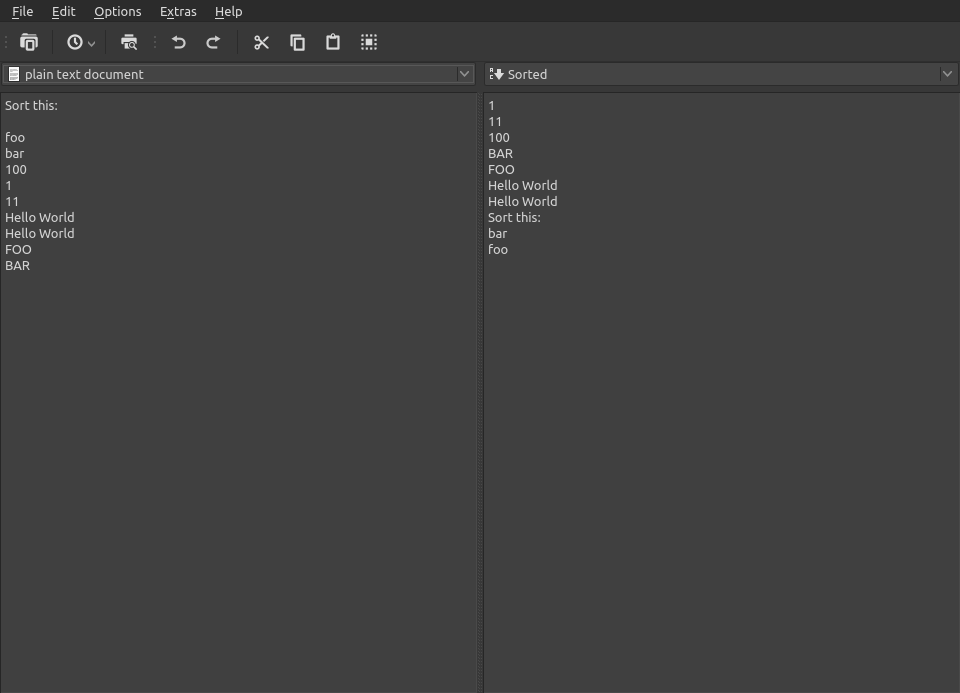

# Converter

Converter is a simple program for converting strings.

## Table of contents

1. [Features](#features)
2. [Preview](#preview)

-------

## Features:

- Save and load files
- Undo-Redo
- Preview converted strings in real time (<1 ms)
- Syntax highlighting editor
- Poor in resources
- Quick opening of recent files (Button in toolbar or in the file menu)
- Open source
- Native look and feel

| From         	| To                                            	|
|--------------	|-----------------------------------------------	|
| **Plain**    		| C-string Sorted MD5 SHA256 SHA512 	|
| **Markdown** 	|                 HTML Plain                 	|
| **HTML**     	|               Markdown Plain               	|
| **C-string** 		|                     Plain                     	|

## Preview

A preview is available [here](https://software-made-easy.github.io/Converter/converter.html).

Important:
- Performance might be bad
